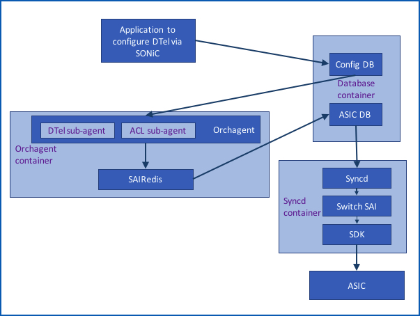
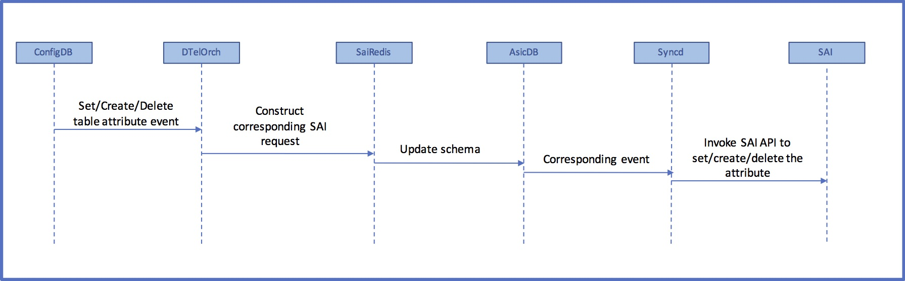
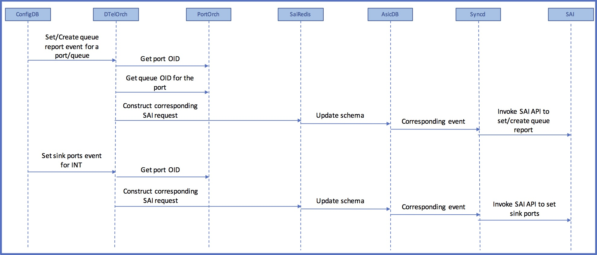
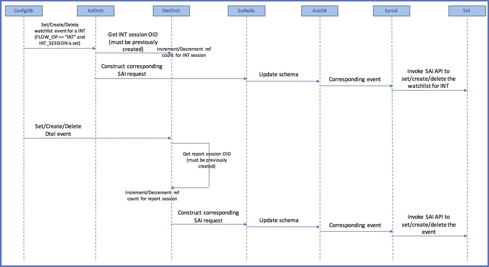

# Dataplane Telemetry in SONiC 
# High Level Design
Revision 0.1

# About this Manual
This document provides general information on Dataplane Telemetry feature implementation in SONiC

# Scope
This document describes the high level design of Dataplane Telemetry feature in SONiC

# Definitions/Abbreviation

Definitions/Abbreviation  | Description
------------------------- | -------------
DTEL / DTel	             | Dataplane Telemetry
ACL                       | Access Control List
SAI                       | Switch Abstraction Interface
INT                       | In-Network Telemetry
DSCP							| Differentiated Services Code Point
OID								| Object IDentifier

# Sub-system Overview 
For more information on Dataplane Telemetry feature, please refer to 
[Dataplane Telemetry SAI API proposal](https://github.com/opencomputeproject/SAI/blob/master/doc/DTEL/SAI-Proposal-Data-Plane-Telemetry.md).

The following figure depicts the overall architecture of SONiC and where Dataplane Telemetry components fit in:



__Figure 1: Dataplane Telemetry in SONiC__. 


Components of SONiC that will be modified or newly added are discussed in the following sub-sections.

## Application to configure DTel via SONiC
This is a new Python-based application that reads and writes DTel-specific configuration into Config DB. This application is currently non-interactive. There are plans to make it interactive in the future. Alternatively, this functionality could be integrated with any SONiC CLI infrastructure that might be developed in the future.

The updated configuration from Config DB can be copied to configDB.json using "config save". This will ensure that DTel configuration is saved across reboots. 

For manually loading configDB.json into Config DB, use "config load"

## Config DB 
### New tables in Config DB for Dataplane Telemetry configuration

Table name				     | Description
----------------------------| -------------
DTEL_TABLE	               | DTel configuration applied at switch global level
DTEL\_REPORT\_SESSION\_TABLE| DTel report session specific configuration
DTEL\_INT\_SESSION\_TABLE   | In-Network Telemetry session specific configuration
DTEL\_QUEUE\_REPORT\_TABLE  | DTel Queue report related configuration
DTEL\_EVENT\_TABLE          | Configuration specific to DTel events that trigger reports 

Please refer to 
[Dataplane Telemetry SAI API proposal](https://github.com/opencomputeproject/SAI/blob/master/doc/DTEL/SAI-Proposal-Data-Plane-Telemetry.md) for more information on the above terminology

#### Schema for DTEL_TABLE

```
; Switch global Dataplane telemetry configuration
; SAI mapping - saidtel.h

key                     = "DTEL_TABLE|SWITCH_ID"
;field                  = value
SWITCH_ID               = 1*DIGIT

key                     = "DTEL_TABLE|FLOW_STATE_CLEAR_CYCLE"
;field                  = value
FLOW_STATE_CLEAR_CYCLE  = 1*DIGIT

key                     = "DTEL_TABLE|LATENCY_SENSITIVITY"
;field                  = value
LATENCY_SENSITIVITY     = 1*DIGIT

key                     = "DTEL_TABLE|SINK_PORT_LIST"
;field                  = value
ifName                  = ifName

key                     = "DTEL_TABLE|INT_ENDPOINT"
;field                  = value
INT_ENDPOINT            = "TRUE" / "FALSE"

key                     = "DTEL_TABLE|POSTCARD"
;field                  = value
POSTCARD                = "TRUE" / "FALSE"

key                     = "DTEL_TABLE|DROP_REPORT"
;field                  = value
DROP_REPORT             = "TRUE" / "FALSE"

key                     = "DTEL_TABLE|QUEUE_REPORT"
;field                  = value
QUEUE_REPORT            = "TRUE" / "FALSE"

key                     = "DTEL_TABLE|INT_L4_DSCP"
;field                  = value
INT_L4_DSCP_VALUE       = 1*DIGIT
INT_L4_DSCP_MASK        = 1*DIGIT
```

Example configuration using redis-cli

    HSET DTEL_TABLE|SWITCH_ID SWITCH_ID "1"
    HSET DTEL_TABLE|FLOW_STATE_CLEAR_CYCLE FLOW_STATE_CLEAR_CYCLE "10"
    HSET DTEL_TABLE|LATENCY_SENSITIVITY LATENCY_SENSITIVITY "100"
    HMSET DTEL_TABLE|SINK_PORT_LIST Ethernet8 "Ethernet8" Ethernet76 "Ethernet76" Ethernet84 "Ethernet84"
    HSET DTEL_TABLE|INT_ENDPOINT INT_ENDPOINT "TRUE"
    HSET DTEL_TABLE|INT_TRANSIT INT_TRANSIT "TRUE"
    HSET DTEL_TABLE|POSTCARD POSTCARD "TRUE"
    HSET DTEL_TABLE|DROP_REPORT DROP_REPORT "TRUE"
    HSET DTEL_TABLE|QUEUE_REPORT QUEUE_REPORT "TRUE"
    HMSET DTEL_TABLE|INT_L4_DSCP INT_L4_DSCP_VALUE "128" INT_L4_DSCP_MASK "255"
    
#### Schema for DTEL\_REPORT\_SESSION\_TABLE

```
; Dataplane telemetry report session configuration
; SAI mapping - saidtel.h

key                     = DTEL_REPORT_SESSION_TABLE|report-session-name ; report-session-name is a 
                                                                        ; unique string representing 
                                                                        ; a report session
;field                  = value
SRC_IP                  = ipv4_addr   ;IP address
DST_IP_LIST             = 1*ipv4_addr ;IP addresses separated by semi-colon
VRF                     = 1*255VCHAR
TRUNCATE_SIZE           = 1*DIGIT
UDP_DEST_PORT           = 1*DIGIT

;value annotations
ipv4_prefix = dec-octet "." dec-octet "." dec-octet "." dec-octet 
dec-octet   = DIGIT                     ; 0-9
                / %x31-39 DIGIT         ; 10-99
                / "1" 2DIGIT            ; 100-199
                / "2" %x30-34 DIGIT     ; 200-249
```
Example configuration using redis-cli

    HMSET DTEL_REPORT_SESSION_TABLE|RS-1 SRC_IP 10.10.10.1 DST_IP_LIST 20.20.20.1;20.20.20.2;20.20.20.3 VRF default TRUNCATE_SIZE 256 UDP_DEST_PORT 2000

#### Schema for DTEL\_INT\_SESSION\_TABLE
```
; Dataplane telemetry INT session configuration
; SAI mapping - saidtel.h

key                         = DTEL_INT_SESSION_TABLE|INT-session-name ; INT-session-name is a 
                                                                      ; unique string representing 
                                                                      ; a INT session
;field                      = value
MAX_HOP_COUNT               = 1*DIGIT
COLLECT_SWITCH_ID           = "TRUE" / "FALSE"
COLLECT_INGRESS_TIMESTAMP   = "TRUE" / "FALSE"
COLLECT_EGRESS_TIMESTAMP    = "TRUE" / "FALSE"
COLLECT_SWITCH_PORTS        = "TRUE" / "FALSE"
COLLECT_QUEUE_INFO          = "TRUE" / "FALSE"
```
Example configuration using redis-cli

    HMSET DTEL_INT_SESSION_TABLE|INT-1 MAX_HOP_COUNT 50 COLLECT_SWITCH_ID TRUE COLLECT_INGRESS_TIMESTAMP TRUE COLLECT_EGRESS_TIMESTAMP TRUE COLLECT_SWITCH_PORTS TRUE COLLECT_QUEUE_INFO TRUE

#### Schema for DTEL\_QUEUE\_REPORT\_TABLE
```
; Dataplane telemetry queue report configuration
; SAI mapping - saidtel.h

key                         = DTEL_QUEUE_REPORT_TABLE|ifName|qnum  ; ifname is the name of the interface
;field                      = value
QUEUE_DEPTH_THRESHOLD       = 1*DIGIT
QUEUE_LATENCY_THRESHOLD     = 1*DIGIT
THRESHOLD_BREACH_QUOTA      = 1*DIGIT
REPORT_TAIL_DROP            = "TRUE" / "FALSE"

;value annotations
qnum = 1*DIGIT ; number between 0 and 7
```
Example configuration using redis-cli

    HMSET DTEL_QUEUE_REPORT_TABLE|Ethernet8|0 QUEUE_DEPTH_THRESHOLD 1000 QUEUE_LATENCY_THRESHOLD 2000 THRESHOLD_BREACH_QUOTA 3000 REPORT_TAIL_DROP TRUE
    
#### Schema for DTEL\_EVENT\_TABLE
```
; Dataplane telemetry event related configuration
; SAI mapping - saidtel.h

key                         = "DTEL_EVENT_TABLE|EVENT_TYPE_FLOW_STATE"
;field                      = value
EVENT_REPORT_SESSION        = 1*255VCHAR ; report-session-name previously configured
EVENT_DSCP_VALUE            = 1*DIGIT

key                         = "DTEL_EVENT_TABLE|EVENT_TYPE_FLOW_REPORT_ALL_PACKETS"
;field                      = value
EVENT_REPORT_SESSION        = 1*255VCHAR ; report-session-name previously configured
EVENT_DSCP_VALUE            = 1*DIGIT

key                         = "DTEL_EVENT_TABLE|EVENT_TYPE_FLOW_TCPFLAG"
;field                      = value
EVENT_REPORT_SESSION        = 1*255VCHAR ; report-session-name previously configured
EVENT_DSCP_VALUE            = 1*DIGIT

key                         = "DTEL_EVENT_TABLE|EVENT_TYPE_QUEUE_REPORT_THRESHOLD_BREACH"
;field                      = value
EVENT_REPORT_SESSION        = 1*255VCHAR ; report-session-name previously configured
EVENT_DSCP_VALUE            = 1*DIGIT

key                         = "DTEL_EVENT_TABLE|EVENT_TYPE_QUEUE_REPORT_TAIL_DROP"
;field                      = value
EVENT_REPORT_SESSION        = 1*255VCHAR ; report-session-name previously configured
EVENT_DSCP_VALUE            = 1*DIGIT

key                         = "DTEL_EVENT_TABLE|EVENT_TYPE_DROP_REPORT"
;field                      = value
EVENT_REPORT_SESSION        = 1*255VCHAR ; report-session-name previously configured
EVENT_DSCP_VALUE            = 1*DIGIT
```

Example configuration using redis-cli

    HMSET DTEL_EVENT_TABLE|EVENT_TYPE_FLOW_STATE EVENT_REPORT_SESSION RS-1 EVENT_DSCP_VALUE 65
    HMSET DTEL_EVENT_TABLE|EVENT_TYPE_FLOW_REPORT_ALL_PACKETS EVENT_REPORT_SESSION RS-1 EVENT_DSCP_VALUE 64
    HMSET DTEL_EVENT_TABLE|EVENT_TYPE_FLOW_TCPFLAG EVENT_REPORT_SESSION RS-1 EVENT_DSCP_VALUE 63
    HMSET DTEL_EVENT_TABLE|EVENT_TYPE_QUEUE_REPORT_THRESHOLD_BREACH EVENT_REPORT_SESSION RS-1 EVENT_DSCP_VALUE 62
    HMSET DTEL_EVENT_TABLE|EVENT_TYPE_QUEUE_REPORT_TAIL_DROP EVENT_REPORT_SESSION RS-1 EVENT_DSCP_VALUE 61
    HMSET DTEL_EVENT_TABLE|EVENT_TYPE_DROP_REPORT EVENT_REPORT_SESSION RS-1 EVENT_DSCP_VALUE 60
    
#### Changes to ACL\_TABLE for DTel watchlist support
Two now ACL table types are introduced to support DTel watchlists:

    ACL_TABLE_DTEL_FLOW_WATCHLIST
    ACL_TABLE_DTEL_DROP_WATCHLIST
    
Table names are:

    DTEL_FLOW_WATCHLIST
    DTEL_DROP_WATCHLIST

#### Changes to ACL\_RULE\_TABLE for DTel watchlist support
New match fields and actions are introduced to support DTel watchlists

**Only incremental changes are shown here. Please refer to ACL_RULE table schema for other fields**

```
; Dataplane telemetry watchlist related config 
; SAI mapping - saiacl.h

key                         = ACL_RULE:table_name:rule_name   ; rule_name is a unique string.
;field                      = value
TUNNEL_VNI                  = 
INNER_ETHER_TYPE            = 1*4HEXDIG ; Ethernet type field of the inner header
INNER_IP_PROTOCOL           = 1*2HEXDIG ; IP protocol type of the inner header
INNER_L4_SRC_PORT           = 1*5DIGIT  ; a number between 0 and 65535
INNER_L4_DST_PORT           = 1*5DIGIT  ; a number between 0 and 65535
FLOW_OP                     = "NOP" / "POSTCARD" / "INT" / "IOAM" ; Applicable only when 
                                                                  ; table name is DTEL_FLOW_WATCHLIST
INT_SESSION                 = 1*255VCHAR ; INT-session-name previously configured.
                                         ; Applicable only when FLOW_OP = INT or IOAM
DROP_REPORT_ENABLE          = "TRUE" / "FALSE" ; Applicable only when table name is DTEL_DROP_WATCHLIST
                                               ; Note: FLOW_OP is not set when this is set
FLOW_SAMPLE_PERCENT         = 1*DIGIT ; number between 0 to 100
                                      ; Applicable only when FLOW_OP = INT or IOAM or POSTCARD
REPORT_ALL_PACKETS          = "TRUE" / "FALSE" ; Applicable only when FLOW_OP = INT or IOAM or POSTCARD

;value annotations
table_name  =  "DTEL_FLOW_WATCHLIST" / "DTEL_DROP_WATCHLIST" ; 

```

Example configuration using redis-cli

    HMSET ACL_RULE|DTEL_FLOW_WATCHLIST|FW-1 PRIORITY 10 SRC_IP 10.1.1.1 DST_IP 20.1.1.1 L4_SRC_PORT 1000 L4_DST_PORT 2000 INNER_ETHER_TYPE 55 INNER_L4_SRC_PORT 3000 INNER_L4_DST_PORT 4000 FLOW_OP POSTCARD FLOW_SAMPLE_PERCENT 80 REPORT_ALL_PACKETS TRUE
    HMSET ACL_RULE|DTEL_FLOW_WATCHLIST|FW-2 PRIORITY 10 INT_SESSION INT-1 FLOW_OP INT
    HSET ACL_RULE|DTEL_DROP_WATCHLIST|DW-1 PRIORITY 10 L4_DST_PORT 2000 DROP_REPORT_ENABLE TRUE
    

## DTel orchagent

Events directed to DTel orchagent will be demuxed based on the ConfigDB table name.

Events handled by DtelOrch agent:

    * Set event
    * Delete event

Any "Set" event issued after a successful "Set" will result in DtelOrch agent issuing a "Delete" followed by a "Set" for the attribute. This eliminates the need to save state in DTelOrch agent and the additional processing needed to compute the diffs between consecutive "Set"s.

Most events are handled as shown in the sequence diagram below. Ones which are different are depicted in the following figures.



__Figure 2: Generic control flow for DTel events__. 

  


__Figure 3: Control flow for DTel events that depend on other Orch agents__. 


###Ref-counted DTel objects

These objects cannot be deleted unless their ref-counts are zeros.

* INT sessions referenced by INT watchlists
* Report sessions referenced by DTel events



__Figure 4: Control flow for DTel events corresponding to ref-counted objects__. 

  
###State maintained by DTelOrch agent

**INT session hashmap**

* Key: INT session id
* Value: 
	* INT session OID
	* Reference count

**Report session hashmap**

* Key: Report session ID
* Value: 
	* Report session OID
	* Reference count

**Port hashmap (ports with atleast one queue on which reporting in enabled)**

* Key: ifName
* Value: 
	* queue list (all queues for a given port on which reporting is enabled)
		* Key: queue id
		* Value:
			* queue report OID

**Event list**

* Key: Event name
* Value:
	* Event OID
		* Report session ID (reference to the Report session)
